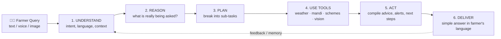
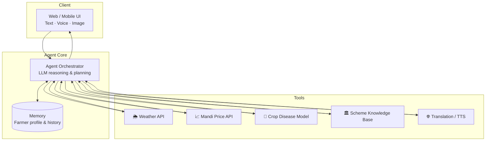

<div align="center">

# 🌾 Krishi Mitra | कृषि मित्र

### *An agentic AI companion that understands, plans and acts for India's farmers*


**Understand → Reason → Plan → Use Tools → Act → Deliver**

[Live Demo](https://drive.google.com/file/d/1vOp9G9uJeFTNPw7sx5hHHLCiLHQq9MWt/view?usp=sharing) · [Features](#-key-features) · [Architecture](#-architecture) · [Setup](#-getting-started) · [Team](#-team)

</div>

---

## 📌 Table of Contents

1. [About the Hackathon](#-about-the-hackathon)
2. [The Problem](#-the-problem)
3. [Our Solution](#-our-solution)
4. [Key Features](#-key-features)
5. [How the Agent Works](#-how-the-agent-works)
6. [Architecture](#-architecture)
7. [Tech Stack](#-tech-stack)
8. [Project Structure](#-project-structure)
9. [Getting Started](#-getting-started)
10. [Usage & Example Scenarios](#-usage--example-scenarios)
11. [Impact & Measurable Value](#-impact--measurable-value)
12. [Roadmap](#-roadmap)
13. [Team](#-team)
14. [License & Acknowledgements](#-license--acknowledgements)

---

## 🏆 About the Hackathon

<table>
<tr><td><b>Event</b></td><td>BHARAT AGENTIC 2026 — <i>Build Bharat. Build the Agents.</i></td></tr>
<tr><td><b>Hackathon Date</b></td><td>1 October 2026</td></tr>
<tr><td><b>Results & Final Demos</b></td><td>2 October 2026</td></tr>
<tr><td><b>Duration</b></td><td>12 hours</td></tr>
<tr><td><b>Mode</b></td><td>Online</td></tr>
<tr><td><b>Prize Pool</b></td><td>₹50,000</td></tr>
<tr><td><b>Team Size</b></td><td>1–4 members</td></tr>
</table>

BHARAT AGENTIC 2026 brings together students, developers, AI builders, designers, founders and innovators to create **practical AI agents for real challenges across India**. The goal is not another chatbot. It is to build agents that can **understand, reason, plan, use tools, take action and deliver outcomes**.

> **The question we set out to answer:** *Can an AI agent solve a real Bharat problem?*

---

## 🎯 The Problem

India has over **100 million farming households**, and most of them make high-stakes decisions every day with incomplete information:

| Pain point | Reality on the ground |
|---|---|
| 🌦️ **Unpredictable weather** | Sowing, irrigation and spraying decisions are made without timely, local forecasts |
| 🐛 **Crop disease & pests** | Late or wrong diagnosis leads to yield loss and excess pesticide use |
| 💰 **Market opacity** | Farmers often don't know current mandi prices and sell below fair value |
| 🏛️ **Scheme awareness** | Eligible government schemes, subsidies and insurance go unclaimed |
| 🗣️ **Language & literacy barriers** | Most advisory apps are English-first, text-heavy and hard to navigate |

Information exists, but it is **scattered, technical and not actionable** for the person who needs it.

---

## 💡 Our Solution

**Krishi Mitra** ("Farmer's Friend") is an **agentic AI assistant** that does more than answer questions. Given a farmer's situation, it reasons about the problem, plans the steps, calls the right tools and data sources, and returns a **clear, actionable recommendation** in the farmer's own language.

Instead of *"Here is some information about wheat rust,"* Krishi Mitra aims for:

> *"Your wheat leaf shows signs of yellow rust. Rain is forecast in 2 days, so spray before then. Here are the recommended options and approximate cost. You may also be eligible for crop-insurance support. Here's how to apply."*

---

## ✨ Key Features

> 📝 **Edit this section** to match what is actually implemented in your repository. Remove anything you did not build and add anything missing.

- 🤖 **Agentic reasoning loop**: breaks a farmer's query into sub-tasks, selects tools and chains them together
- 🌱 **Crop advisory**: season-, soil- and region-aware recommendations
- 🔬 **Disease & pest identification**: diagnosis from a described symptom or an uploaded leaf image
- 🌦️ **Weather-aware planning**: forecasts feed directly into sowing, irrigation and spraying advice
- 📈 **Mandi price intelligence**: current market rates to help decide when and where to sell
- 🏛️ **Government scheme discovery**: surfaces relevant schemes with eligibility and application steps
- 🗣️ **Multilingual, farmer-friendly interface**: Hindi, Marathi and English, with simple language
- 🎙️ **Voice-first access** *(if implemented)*: speak in, listen back, with no typing required
- 🧠 **Context memory**: remembers the farmer's location, crops and past queries

---

## 🧠 How the Agent Works

Krishi Mitra follows the hackathon's core agentic loop end to end:



| Stage | What Krishi Mitra does |
|---|---|
| **Understand** | Detects language and intent; pulls in saved context (location, crop, season) |
| **Reason** | Decides what information is missing and what risks or opportunities exist |
| **Plan** | Creates an ordered plan, for example *check weather → diagnose → find treatment → check schemes* |
| **Use Tools** | Calls external APIs and models (weather, market prices, scheme data, vision/LLM) |
| **Act** | Synthesises results into concrete steps, with timing, quantities and alerts |
| **Deliver** | Responds in plain, local language, as text and optionally voice |

---

## 🏗️ Architecture



> 📝 Update the diagram boxes to reflect the tools and services your project really uses.

---

## 🛠️ Tech Stack

> 📝 **Replace with your actual stack.** The table below is a template.

| Layer | Technology |
|---|---|
| **Frontend** | `<e.g. React / Next.js / HTML-CSS-JS / Streamlit>` |
| **Backend** | `<e.g. Python (FastAPI / Flask) / Node.js (Express)>` |
| **LLM / Agent framework** | `<e.g. Claude API / Gemini / OpenAI · LangChain / LangGraph / custom loop>` |
| **Vision / ML** | `<e.g. plant-disease classifier, vision-capable LLM>` |
| **Data & APIs** | `<e.g. Open-Meteo, Agmarknet, government scheme data>` |
| **Database / Memory** | `<e.g. SQLite / MongoDB / Firebase>` |
| **Voice & Language** | `<e.g. Web Speech API / Google TTS / Bhashini>` |
| **Deployment** | `<e.g. Vercel / Render / Hugging Face Spaces>` |

---

## 📁 Project Structure

> 📝 Replace with the real tree (run `tree -L 2` in your repo).

```
Krishi_mitra/
├── frontend/            # UI (chat, voice, image upload)
├── backend/             # API server and agent logic
│   ├── agent/           # Orchestrator, planner, prompts
│   ├── tools/           # Weather, mandi, schemes, disease detection
│   └── memory/          # Farmer profile & conversation store
├── data/                # Scheme data, sample datasets
├── docs/                # Screenshots, diagrams, demo assets
├── .env.example         # Required environment variables
├── requirements.txt     # or package.json
└── README.md
```

---

## 🚀 Getting Started

### Prerequisites

- `<Python 3.10+ / Node.js 18+>`
- `<API keys: LLM provider, weather, etc.>`
- Git

### 1. Clone the repository

```bash
git clone https://github.com/jaiashwinisatish/Krishi_mitra.git
cd Krishi_mitra
```

### 2. Configure environment variables

```bash
cp .env.example .env
```

```env
# Example, adjust to your project
LLM_API_KEY=your_key_here
WEATHER_API_KEY=your_key_here
```

### 3. Install dependencies

```bash
# Python
pip install -r requirements.txt

# or Node.js
npm install
```

### 4. Run the project

```bash
# Replace with your actual start command
python app.py
# or
npm run dev
```

Open **http://localhost:3000** (or your configured port) in your browser.

---

## 🎬 Usage & Example Scenarios

| 👨‍🌾 Farmer says | 🤖 Krishi Mitra does |
|---|---|
| *"My tomato leaves have brown spots."* | Identifies the likely disease → checks weather → recommends treatment and timing |
| *"Should I sell my soybean today?"* | Fetches nearby mandi prices → compares trends → suggests sell / wait |
| *"What schemes can I get for drip irrigation?"* | Matches farmer profile to schemes → explains eligibility and how to apply |
| *"What should I sow this season?"* | Considers location, soil and weather → suggests suitable crops |

> 📸 **Add screenshots or a GIF here** (`docs/demo.gif`). Visuals make a big difference to judges.

---

## 📊 Impact & Measurable Value

The hackathon asks for agents that **create measurable value for users**. Krishi Mitra targets:

| Metric | Goal |
|---|---|
| ⏱️ **Time to advice** | From hours or days of searching to **seconds** |
| 🌾 **Yield protection** | Earlier disease detection means less crop loss |
| 💸 **Better income** | Informed selling decisions using live mandi data |
| 🧪 **Input efficiency** | Targeted, weather-timed spraying means less wasted pesticide and money |
| 🏛️ **Scheme uptake** | Farmers discover benefits they were eligible for but never knew about |
| 🌐 **Accessibility** | Local-language, simple-interface access for first-time digital users |

---

## 🗺️ Roadmap

- [x] Core agentic reasoning loop
- [x] Weather, market and advisory tool integration
- [ ] Offline / low-bandwidth mode
- [ ] WhatsApp and SMS interface
- [ ] More regional languages and dialects
- [ ] Satellite and soil-health data integration
- [ ] Community and FPO (Farmer Producer Organisation) features
- [ ] Proactive alerts (weather warnings, price spikes)

> 📝 Tick or adjust items to match your real progress.

---

## 👥 Team

| Name | Role | GitHub |
|---|---|---|
| **Ashwini Satish Jai** | `<Role>` | [@jaiashwinisatish](https://github.com/jaiashwinisatish) |
| `<Member 2>` | `<Role>` | `<link>` |
| `<Member 3>` | `<Role>` | `<link>` |
| `<Member 4>` | `<Role>` | `<link>` |

Built with ❤️ in **12 hours** for **BHARAT AGENTIC 2026**.

---

## 📄 License & Acknowledgements

Released under the **MIT License**. See [`LICENSE`](LICENSE) for details.

**Thanks to:** the BHARAT AGENTIC 2026 organisers and mentors, open data providers (weather, mandi and government datasets), and the open-source community.

> ⚠️ **Disclaimer:** Krishi Mitra is a hackathon prototype. Its advice is for informational purposes and should be verified with local agricultural experts or extension officers (KVK) before major farming decisions.

---

<div align="center">

### 🌾 *Jai Jawan, Jai Kisan, Jai Vigyan* 🌾

**Build Bharat. Build the Agents.**

⭐ If you like this project, please star the repo!

</div>
